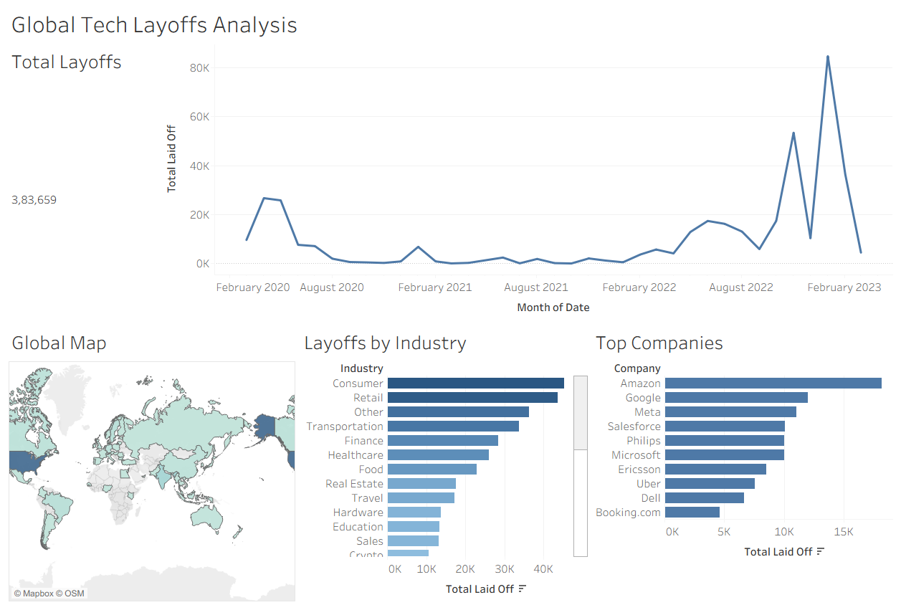

# Global Tech Layoffs Analysis (SQL & Tableau)

An end-to-end data analysis and visual storytelling project investigating global tech workforce reductions from 2020 to 2023.

## 📊 Executive Dashboard Preview

> **Note:** To interact with the full workbook locally, download `World_Layoffs_Analysis.twbx` from this repository and open it in Tableau Desktop or Tableau Reader.

## 🛠️ Tech Stack & Skills
* **Database & Querying:** MySQL (Window Functions, CTEs, Self-Joins, Data Imputation, Schema Standardization)
* **Data Visualization:** Tableau Desktop (KPIs, Time Series Analysis, Geographic Mapping, Interactive Filtering)
* **Dataset:** 2,000+ global layoff records (Company, Industry, Country, Stage, Funds Raised)

## 🔍 Key Insights Discovered
* **Peak Workforce Reductions:** Layoffs accelerated sharply in late 2022 and reached a peak in January 2023.
* **Vulnerable Sectors:** The Consumer, Retail, and Transportation industries absorbed the highest total workforce cuts.
* **Geographic Concentration:** The United States accounted for the largest share of layoffs globally, driven primarily by late-stage and publicly traded tech giants.

## 📁 Repository Structure
* `/World Layoffs (Data Cleaning).sql`: Scripts for deduplication, null imputation, and data type normalization.
* `/Exploratory Data Analysis.sql`: Queries for rolling totals, dense ranking, and multi-factor aggregations.
* `/World_Layoffs_Analysis.twbx`: Complete Tableau packaged workbook.
